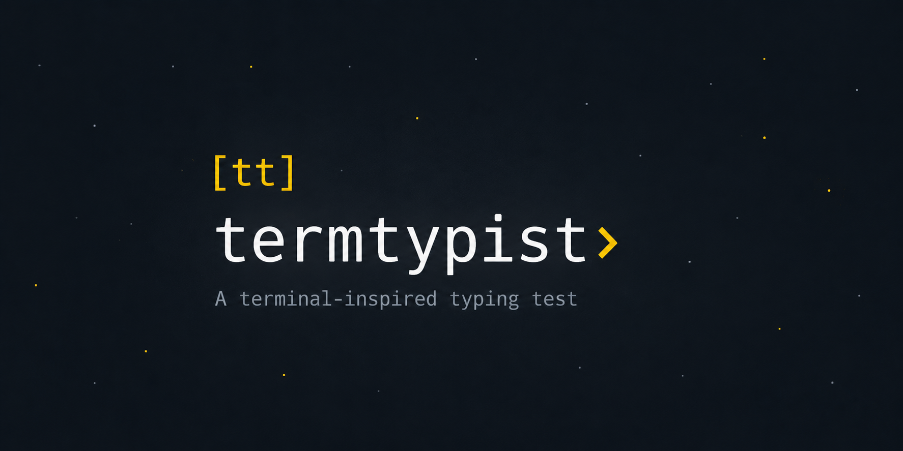
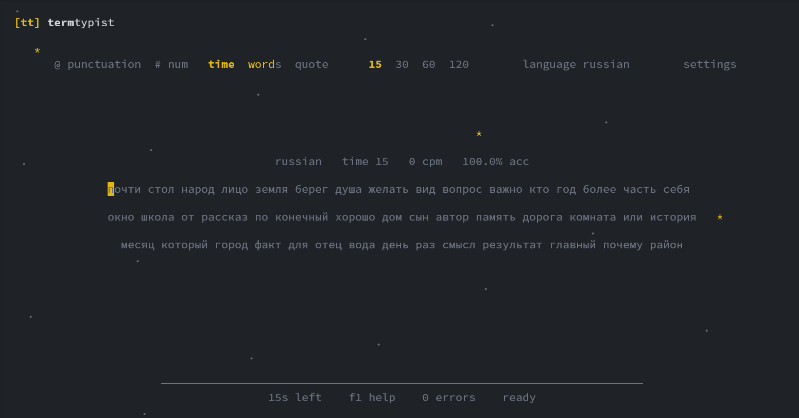

<p align="center">
  
</p>

<p align="center">
  <a href="LICENSE"></a>
  <a href="https://github.com/hase9awa/termtypist/releases"></a>
  <a href="https://aur.archlinux.org/packages/termtypist"></a>
  <a href="https://github.com/hase9awa/termtypist"></a>
</p>

# termtypist

Терминальный тренажер печати с управлением с клавиатуры. Вдохновлен Monkeytype, но работает локально, быстро и без выхода из терминала.

<p align="center">
  
</p>

https://github.com/hase9awa/termtypist/raw/main/assets/video.mp4

<p align="center">
  <a href="assets/video.mp4">Открыть видео демонстрации</a>
</p>

## Возможности

- Режимы по времени, словам, цитатам, своему тексту и повтору последнего теста.
- Встроенные английские и русские словари, плюс пользовательские словари.
- Локальная история в SQLite, личные рекорды, графики результатов и тепловая карта клавиатуры.
- Темы, пунктуация, числа, уровни сложности, blind mode и настраиваемые клавиши.
- Поддержка мыши там, где она удобна, но все действия доступны с клавиатуры.

## Установка

Arch Linux через AUR:

```sh
yay -S termtypist
# или
paru -S termtypist
```

Из исходников:

```sh
cargo install --git https://github.com/hase9awa/termtypist --locked
```

Пакет в AUR: <https://aur.archlinux.org/packages/termtypist>

## Использование

```sh
termtypist
termtypist --time 30
termtypist --words 50 --dictionary english
termtypist quote --length medium
termtypist custom text.txt
cat text.txt | termtypist custom
termtypist stats
termtypist replay last
termtypist theme list
termtypist theme set catppuccin
termtypist config export > config.toml
termtypist config import config.toml
```

Основные клавиши:

| Клавиша | Действие |
| --- | --- |
| `tab` | Рестарт |
| `ctrl+r` | Повторить тот же текст |
| `esc` | Пауза или закрыть окно |
| `f1` | Справка |
| `ctrl+enter`, `f2` | Настройки |
| `alt+t`, `alt+w`, `alt+q` | Режим времени, слов, цитат |
| `alt+d` | Словарь |
| `alt+p`, `alt+n` | Пунктуация, числа |
| `r`, `e` | История, тепловая карта |
| `ctrl+c` | Выход |

## Файлы

termtypist хранит пользовательские данные локально:

- Конфиг, словари, цитаты и темы: `~/.config/termtypist`
- База результатов: каталог данных платформы, файл `termtypist/results.sqlite`

Переменная `TERM_TYPIST_CONFIG_DIR` позволяет задать другой каталог конфига.

Пользовательские словари можно положить в `~/.config/termtypist/languages` в формате `txt`, `json` или `toml`. Пользовательские темы и наборы цитат используют те же форматы в каталогах `themes` и `quotes`.

## Лицензия

GPL-3.0-or-later

---

## English

Keyboard-first typing trainer for the terminal. It is inspired by Monkeytype, but keeps the workflow local, fast, and terminal-native.

### Features

- Time, words, quote, custom text, and replay modes.
- English and Russian dictionaries, with support for custom dictionaries.
- Local SQLite history, personal bests, result charts, and keyboard heatmaps.
- Themes, punctuation and number toggles, difficulty modes, blind mode, and configurable keybindings.
- Mouse support where useful, while every action remains available from the keyboard.

### Install

Arch Linux via AUR:

```sh
yay -S termtypist
# or
paru -S termtypist
```

From source:

```sh
cargo install --git https://github.com/hase9awa/termtypist --locked
```

AUR package: <https://aur.archlinux.org/packages/termtypist>

### Usage

```sh
termtypist
termtypist --time 30
termtypist --words 50 --dictionary english
termtypist quote --length medium
termtypist custom text.txt
cat text.txt | termtypist custom
termtypist stats
termtypist replay last
termtypist theme list
termtypist theme set catppuccin
termtypist config export > config.toml
termtypist config import config.toml
```

Default keys:

| Key | Action |
| --- | --- |
| `tab` | Restart |
| `ctrl+r` | Retry the same text |
| `esc` | Pause or close |
| `f1` | Help |
| `ctrl+enter`, `f2` | Settings |
| `alt+t`, `alt+w`, `alt+q` | Time, words, quote mode |
| `alt+d` | Dictionary |
| `alt+p`, `alt+n` | Punctuation, numbers |
| `r`, `e` | History, heatmap |
| `ctrl+c` | Quit |

### Files

termtypist writes user data locally:

- Config, dictionaries, quotes, and themes: `~/.config/termtypist`
- Results database: platform data directory under `termtypist/results.sqlite`

Set `TERM_TYPIST_CONFIG_DIR` to use a different config directory.

Custom dictionaries can be `txt`, `json`, or `toml` files under `~/.config/termtypist/languages`. Custom themes and quote sets use the same formats under `themes` and `quotes`.

### License

GPL-3.0-or-later
